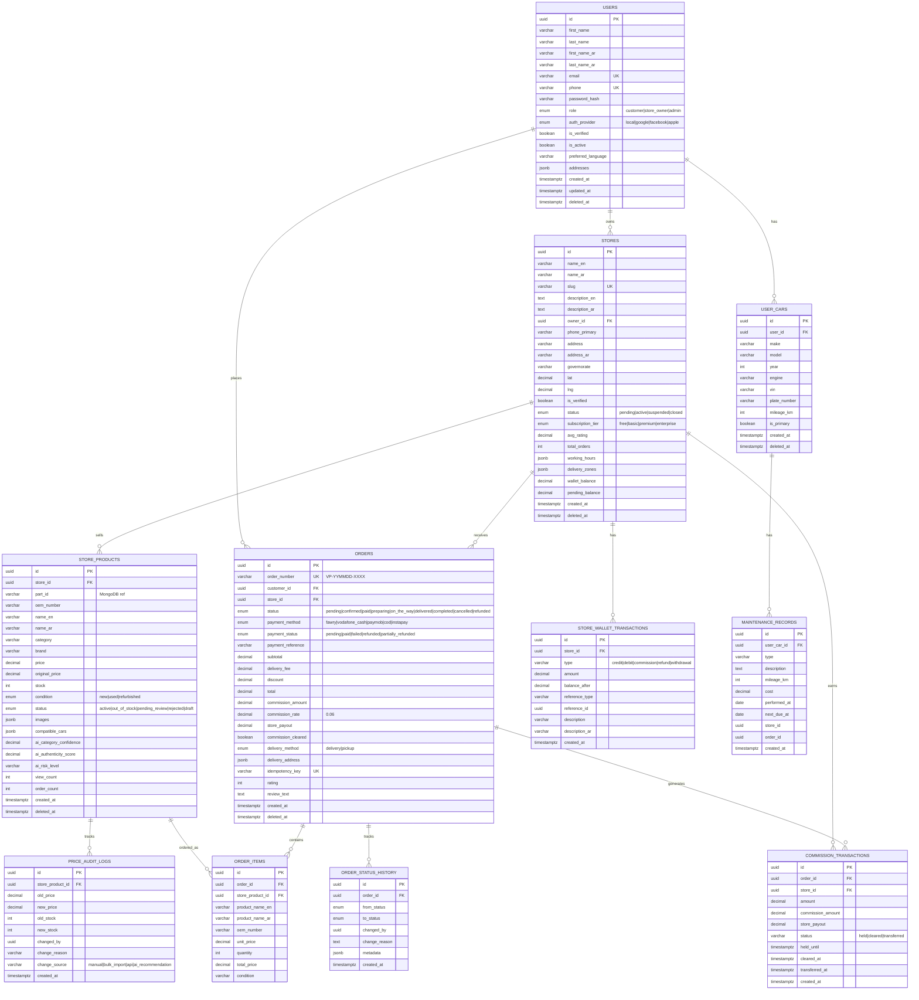

# VeeParts Database Schema - Entity Relationship Diagram

## ERD (Mermaid)



## MongoDB Collections (Flexible Schema)

### car_parts Collection
```json
{
  "_id": "ObjectId",
  "oemNumber": "string (unique, indexed)",
  "nameAr": "string (text indexed, weight: 10)",
  "nameEn": "string (text indexed, weight: 8)",
  "descriptionAr": "string (text indexed)",
  "category": "enum (indexed)",
  "subcategory": "string",
  "brand": "string (indexed)",
  "alternativeOemNumbers": ["string"],
  "crossReferenceNumbers": ["string"],
  "compatibleCars": [{
    "make": "string",
    "model": "string",
    "yearFrom": "number",
    "yearTo": "number",
    "engine": "string"
  }],
  "images": ["string"],
  "specifications": {
    "weight": "number",
    "dimensions": "object"
  },
  "additionalAttributes": "Map<string, string>",
  "tags": ["string"],
  "tagsAr": ["string"],
  "marketMedianPrice": "number (indexed)",
  "totalListings": "number",
  "isActive": "boolean"
}
```

### car_compatibility Collection
```json
{
  "_id": "ObjectId",
  "make": "string (indexed)",
  "makeAr": "string",
  "model": "string (indexed)",
  "modelAr": "string",
  "yearFrom": "number",
  "yearTo": "number",
  "engine": "string",
  "fuelType": "string",
  "transmission": "string",
  "bodyType": "string",
  "partIds": ["ObjectId (indexed)"],
  "partsByCategory": "Map<string, [ObjectId]>"
}
```

## Index Strategy

### PostgreSQL Indexes
| Table | Index | Type | Purpose |
|-------|-------|------|---------|
| users | idx_users_email | UNIQUE (partial) | Login lookup |
| users | idx_users_phone | UNIQUE (partial) | Phone login |
| users | idx_users_role | B-tree | Role filtering |
| stores | idx_stores_slug | UNIQUE (partial) | URL lookup |
| stores | idx_stores_governorate | B-tree | Location filter |
| stores | idx_stores_location | B-tree (lat,lng) | Geo queries |
| store_products | idx_store_products_store_part_condition | UNIQUE (partial) | Prevent duplicates |
| store_products | idx_store_products_name_ar_trgm | GIN (pg_trgm) | Arabic fuzzy search |
| store_products | idx_store_products_name_en_trgm | GIN (pg_trgm) | English fuzzy search |
| store_products | idx_store_products_oem | B-tree | OEM lookup |
| orders | idx_orders_order_number | UNIQUE | Order lookup |
| orders | idx_orders_idempotency | UNIQUE (partial) | Idempotency |
| orders | idx_orders_created | B-tree | Time queries |
| price_audit_logs | idx_price_audit_created | B-tree | Audit timeline |

### MongoDB Indexes
| Collection | Index | Type | Purpose |
|------------|-------|------|---------|
| car_parts | text_search_index | Text (weighted) | Arabic full-text search |
| car_parts | compatibleCars compound | Compound | Car compatibility lookup |
| car_parts | category + brand | Compound | Category browsing |
| car_compatibility | make + model + year | Compound UNIQUE | Car lookup |
